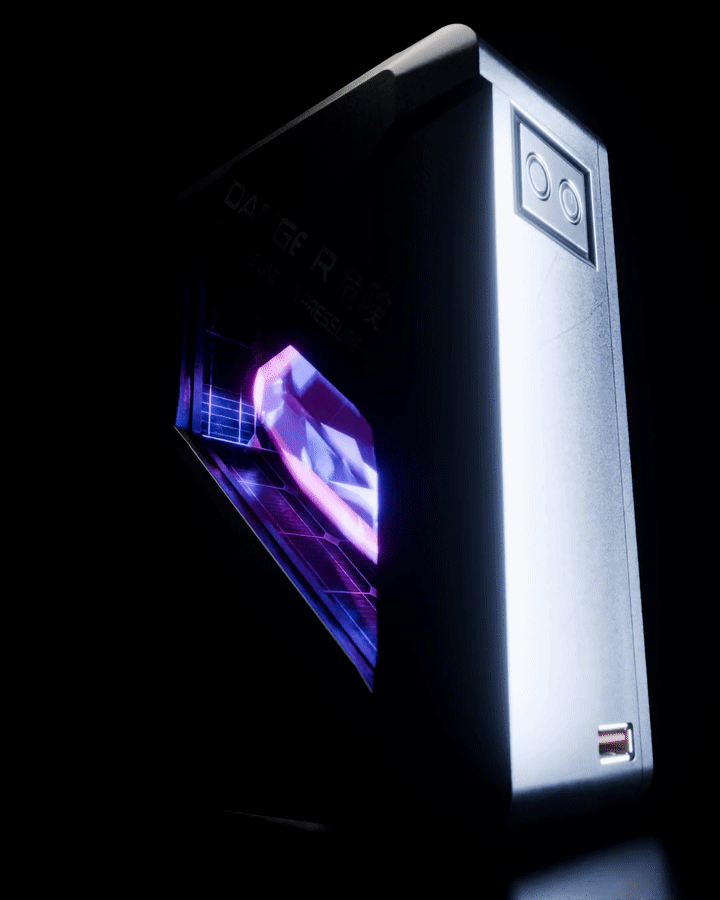

  

  
  
  

 

> **I'm obsessed with human knowledge.** We know so much collectively, and it honestly bugs me that I can't learn it all in one lifetime. I am a CS student, but I hate separating art and science. I love to paint and draw, but I also like making software. I love to understand random physics and biology concepts. *I just wanna learn things.*

 

### ⌖ The Rabbit Holes (3D, Robotics & AI)
I learn by getting obsessed with a concept and building it.

I got curious about 3D modeling. That led me to Blender, Fusion, and UE5, which subsequently dragged me into robotics and AR/VR. (You can check out my hard-surface models on my [ArtStation](https://www.artstation.com/swayamohapatra)).

 

  

 

    

 

---

### ⌖ Trinity
I got fascinated by Jarvis, so I built **[Trinity](https://github.com/QuantumChrono/Project-Trinity)**. It is a distributed local AI system. I bridged a PC and a laptop using Tailscale, separating the vision hub from the LLM inference engine, and routed workloads across dual-T4 GPUs to run a 40B parameter model, mostly just to see if I could make the architecture work.

 

    

 

---

### ⌖ One-Day Sprints
I like making random stuff in one day. I use AI heavily for boilerplate and syntax, which lets me focus on architecture, UX, and product decisions.

| Project | Description |
| :--- | :--- |
| **[Unicorpse](https://unicorpse.vercel.app)** | A web app that brutally roasts your startup ideas based on Peter Thiel's *Zero to One*. Built to learn Next.js routing and Groq API integrations. When the LLM took too long to respond, I built a dynamic mini spaceship game to collect coins while you wait. |
| **[ExportMarkdown](https://exportmarkdown.com)** | An entirely client-side markdown converter. No servers, no uploads. The conversion happens completely in the browser. Built mainly to learn about domains and Cloudflare. *Seeing my SEO score go up was honestly way more fun than getting the website ready.* |
| **[Gatekeeper](https://usegatekeeper.vercel.app)** | An AI ticket analyzer with a human approval gate and prompt-injection defense built with Next.js and Supabase. Made in a few hours for a hackathon where we placed 4th out of 285 teams. The core is a strict state machine that controls when actions can actually execute. |

 

    

 

---

### ⌖ Beyond the Screen
When I am not coding, I play the piano and video games. I wanna learn the guitar, I wanna get into sports and combat, I wanna do calisthenics, I wanna make music, I wanna learn modeling, how to dance, and a lot more.

> **Fun fact:** I am left-handed, but when I injured my left shoulder, I forcefully taught myself to write with my right hand just because I thought it would be cool. Now I am kind of ambidextrous.
